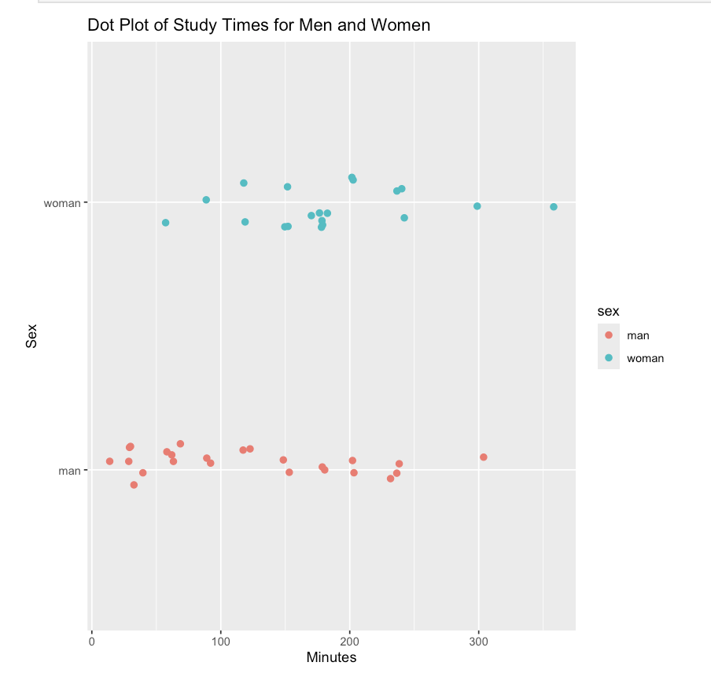
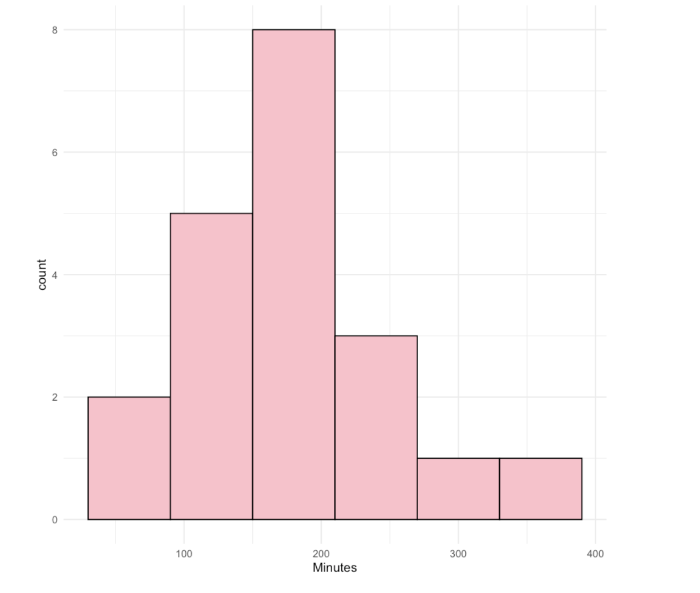
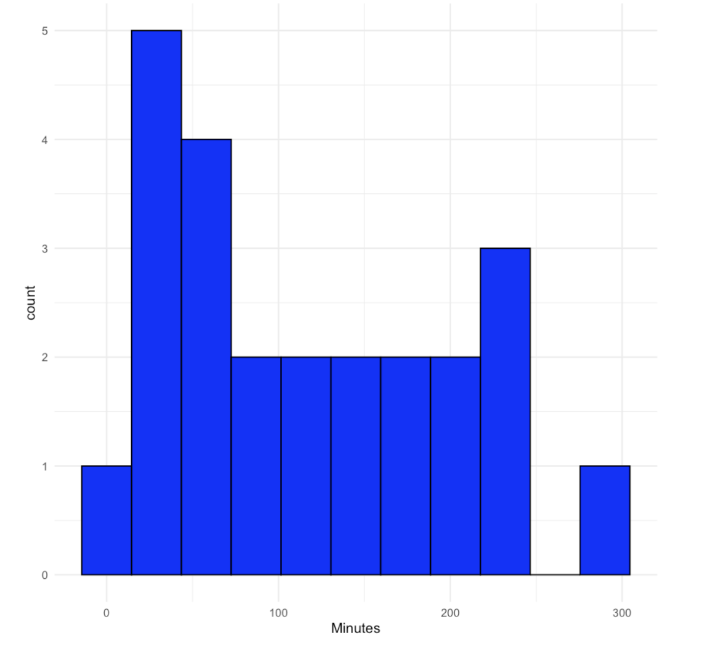
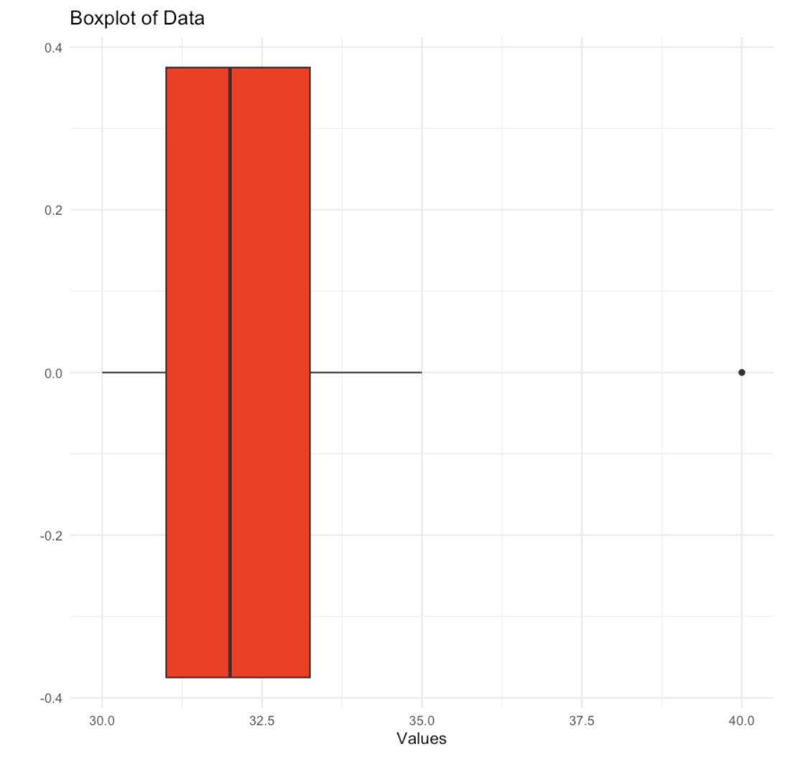

# Exploring Data with R
By James Weaver

# Introduction
This project applies fundamental statistical concepts using R to explore datasets, perform analyses, and create meaningful visualizations. Tasks include identifying variable types, creating dot plots, histograms, and boxplots, calculating probabilities with normal distributions, and designing experiments.

This project is designed for aspiring data scientists to showcase their understanding of data exploration techniques.

# Files
- exploring_data_ch1.ipynb: Main Jupyter Notebook containing the entire R-based analysis, answers, and visualizations.
- datasets/: Folder with sample datasets used for various questions.
- README.md: Detailed explanation of the project.
- images/: Folder containing saved visualizations (e.g., histograms, dot plots).

# Analysis and Tasks
1. **Identifying Variables in a Dataset**
- Categorized variables as categorical or quantitative using a small dataset.
Key Insight:
- States and ZIP Codes are categorical, while Family Size and Annual Income are quantitative.
  
2. **Visualizing Study Time**
- Created dot plots, histograms, and manual back-to-back stem-and-leaf plots to analyze study times for men and women.

Visualizations:
- Dot Plot: Highlights individual study times.
- Histograms: Shows the distribution and center.

**Key Findings**:
- Men's study time has a center around 120 minutes and is slightly right-skewed.
- Women's study time has a center around 150 minutes and is also right-skewed.

3. **Summary Statistics and Boxplots**
- Calculated mean, median, Q1, Q3, and IQR for a given dataset.
- Created a boxplot to visualize the spread and potential outliers.
Results:
- Mean: 32.7
- Median: 32
- IQR: 2.25

4. **Two-Way Frequency Tables and Conditional Distributions**
- Analyzed a hair color dataset to compute marginal values and conditional distributions.
**Insights**:
- Marginal values summarize totals for hair color and gender.
- Conditional distributions reveal proportions of gender within each hair color category.

5. **Normal Distribution and Probability**
- Analyzed a gestation period dataset assuming a normal distribution.
- Calculated probabilities for ranges and thresholds using Z-scores.
**Results**:
- P(gestation < 36 weeks): 0.19
- P(gestation > 39 weeks): 0.33
- Top 5% of gestations occur after 292 days.
  
**Tools and Libraries**
- R: Core programming language for statistical analysis.
- ggplot2: For data visualization (dot plots, histograms, and boxplots).
- dplyr: For data manipulation and summarization.

**Key Visualizations**
Dot Plot of Study Times

Histograms of Study Times
- Histogram For Women

-Histogram For Men

Boxplot for Summary Statistics

# Future Improvements
- Use real-world datasets (e.g., Kaggle or UCI Machine Learning Repository).
- Expand visualizations to include scatter plots and heatmaps.
- Automate the generation of summary statistics and visualizations using functions.

# Conclusion
This project demonstrates the fundamentals of data exploration using R, from visualizations to probability analysis and experimental design. It highlights critical skills required for a data scientist, such as interpreting distributions, creating plots, and applying statistical concepts.
